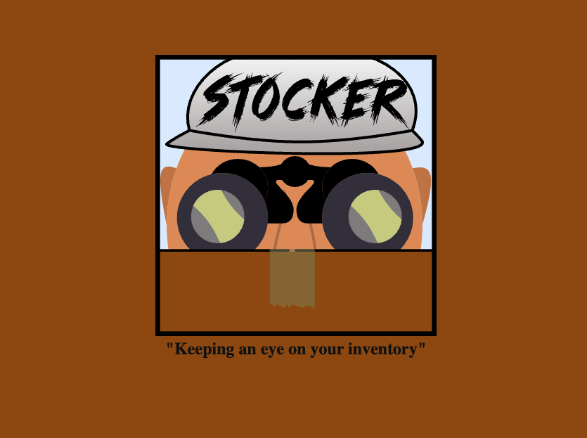
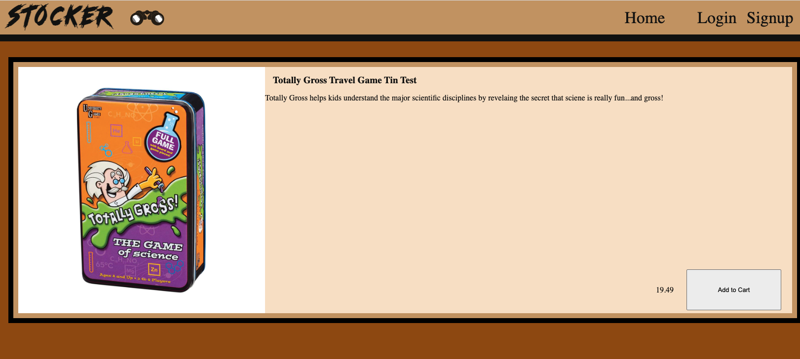
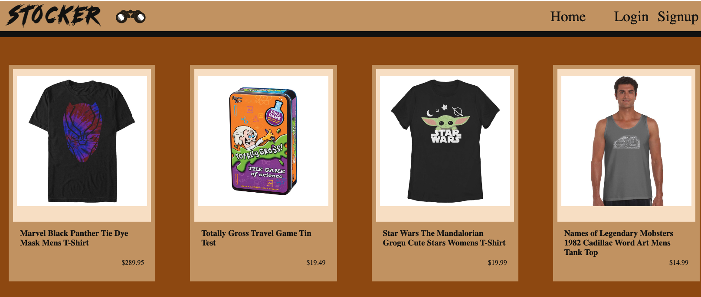
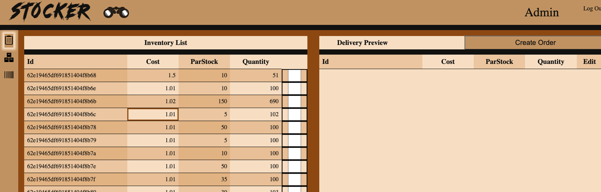
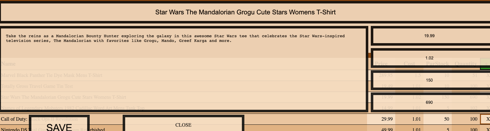
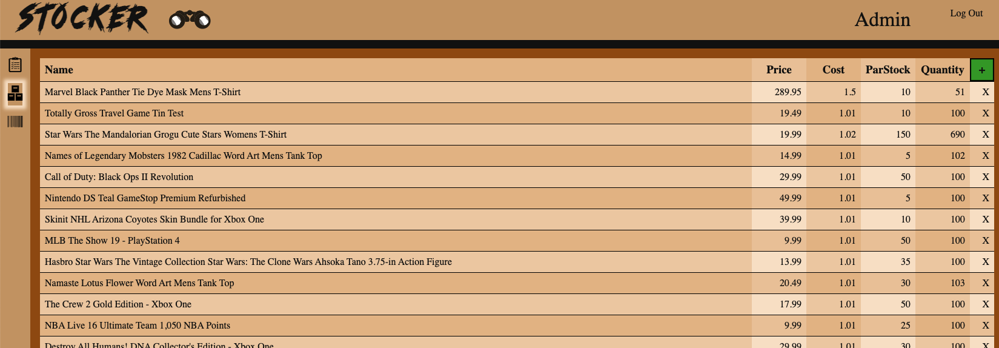
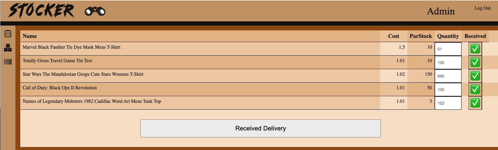
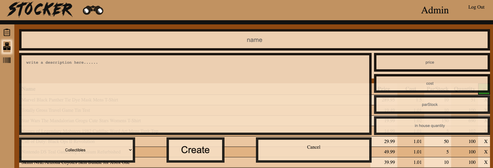

# Stocker Inventory Management App

  This project is licensed under the  .
    
  ## Description:
 An inventory management system that integrates with a fully functional eCommerce site.  Once product details are inserted into the database the inventory is updated with every sale and with every shipment received. This app strives to be the only piece of software a small business needs.
       
  ## Table of contents
  * [Description](#description)
  * [Installation](#installation)
  * [Usage](#usage)
  * [Screenshots](#screenshots)
  * [Technology](#technology)
  * [Contributing](#contributing)
  * [Questions](#questions)
      
  ## Installation
  npm install

  npm run develop

  ## Usage

  This app is meant to be used in a small business setting where a client is looking to launch their store into the Ecommerce world.

  ## Screenshots

---
---

---
---

---
---

---
---

---
---

---
---

---
---

---
---
  ## Technology

Mongodb Express React Node GraphQL Apollo JWT authentication

  ## Contributing
  if you would like to become a collaberator on this project please feel free to look at the issues tab and contact anyone below.

  ## Questions
  For questions please contact: 
  ---
  James, Fraser, Stephen or Tyler  
  ---
  ---
  [james.edward.pritchard@gmail.com](mailto:james.edward.pritchard@gmail.com)
  ---
  [ydennekrf@gmail.com](mailto:ydennekrf@gmail.com)
  ---
  [sfudge@gmail.com](mailto:sfudge@gmail.com)
  ---
  [tyler.omoto@gmail.com](mailto:tyler.omoto@gmail.com)
  ---
  
  
  Github Profiles: 
  ---
  [James Pritchard](https://github.com/SuedePritch)
  ---
  [Fraser Kennedy](https://github.com/ydennekrf)
  ---
  [Steven Fudge](https://github.com/stephenfudge)
  ---
  [Tyler Omoto](https://github.com/tyomoto) 
  ---